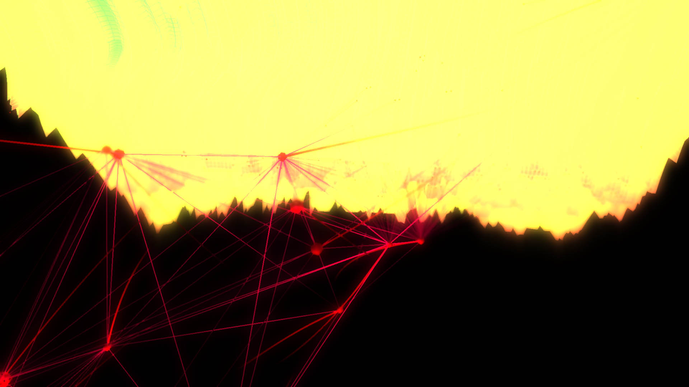
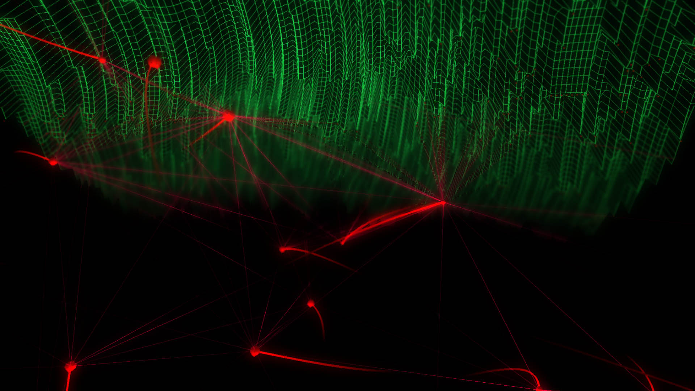
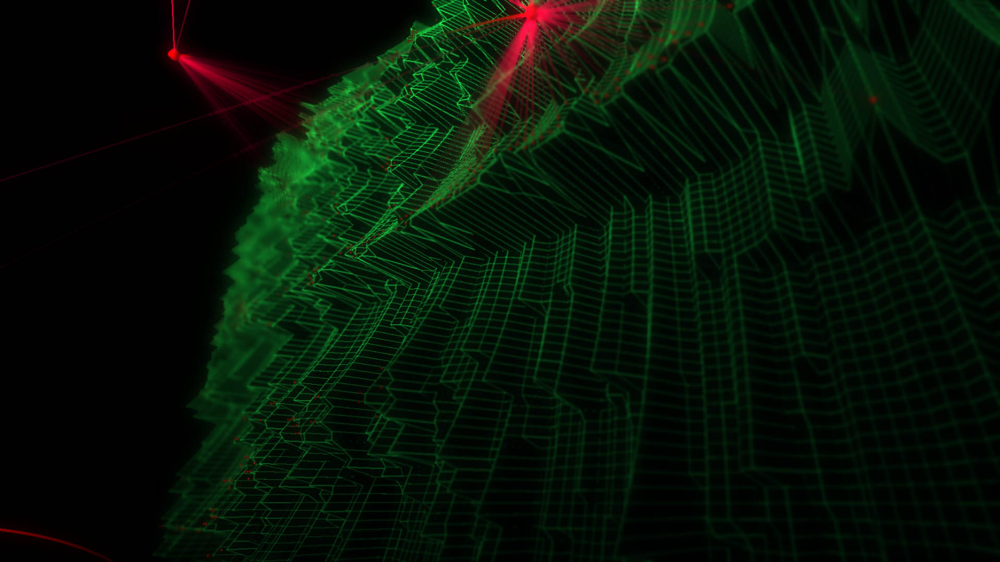
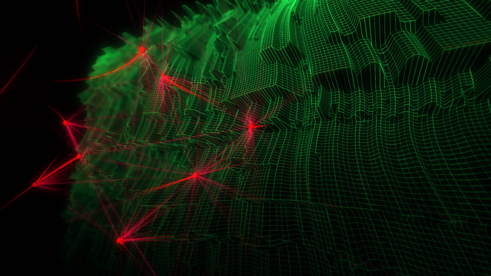

# Sentinels
Music credit: Pan Sonic - Pan finale

Sentinels started as to generate a wireframe look terrain without diagonal lines between vertices. Then, I added wandering particles to create a flow on the composition. I really love to connect different forms together via lines. After all, the floating particles around using Perlin Noise remind me of the ones in The Matrix movie. 

## Running the project 

1- Dependencies:
-   ofxGui: builtin addon
-   [ofxFilika](https://github.com/FilikaDesign/ofxFilika)
-   [ofxDof](https://github.com/obviousjim/ofxDOF)
-   [ofxPostProcessing](https://github.com/neilmendoza/ofxPostProcessing)

2- Import project folder into openFrameworks project generator app. Be sure you have all of the necessary addons.

3- Run the app. Keyboard interaction
- Hit '**g**' key on keyboard to show/hide GUI
- Hit '**s**' key on keyboard to save current image as png file.
- Hit '**g**' key on keyboard to show/hide GUI
- Hit '**.**' key (dot character) on keyboard to enable mesh gradient color fill. The higher peak values will be red, lower audio values will be yellow.
- Hit '**<**' key on keyboard to start autopilot option for the virtual camera.

