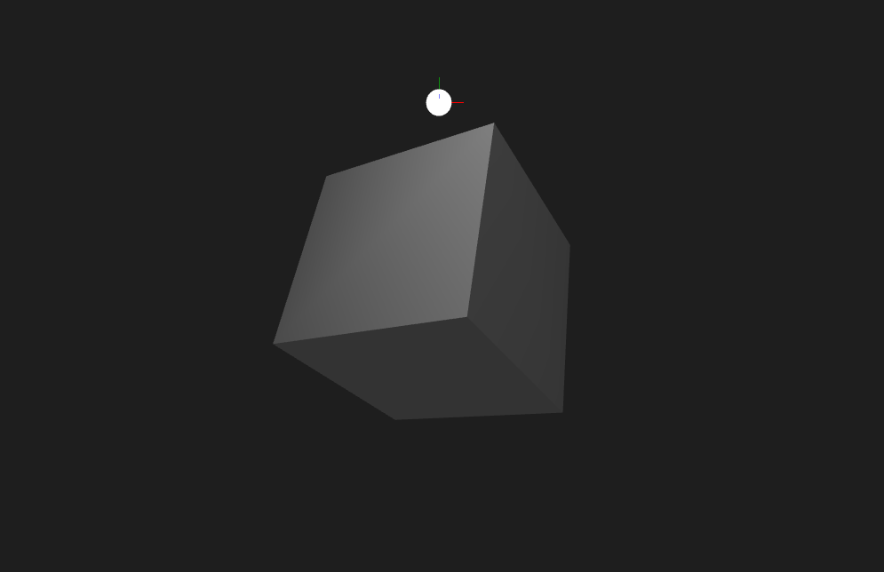
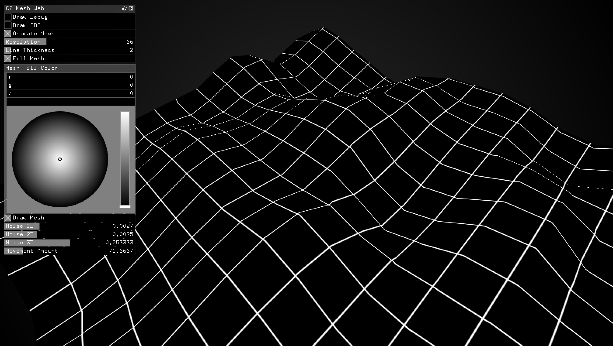
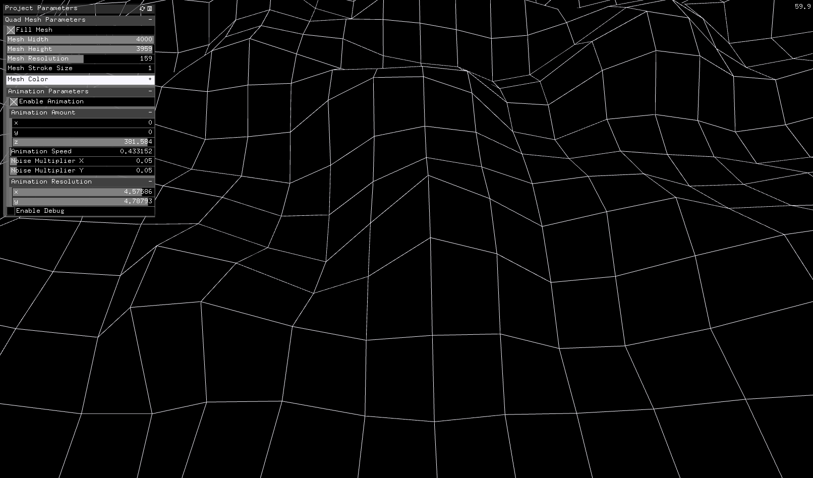
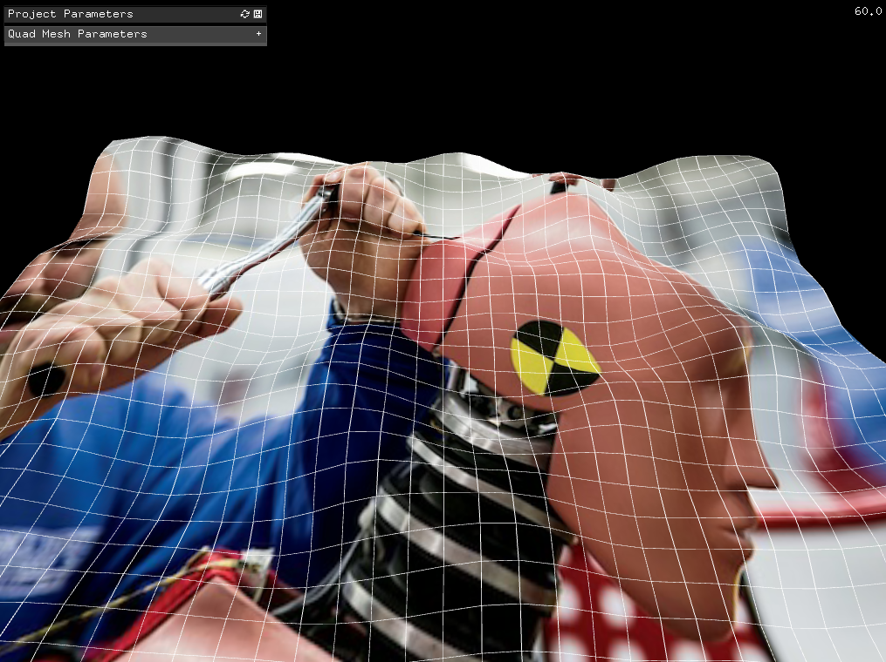
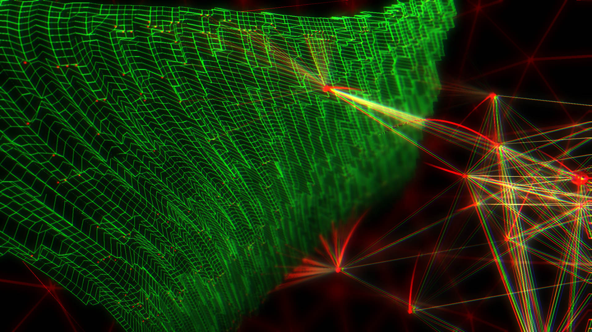

# 3D-Studies-with-openFrameworks
Bunch of projects to generate 3d meshes. Main purposes are to understand 3D space in c++/openFrameworks and to have full control over vertex coordinates. This repo will be updated frequently. These projects are not for production usage. But, they help you to understand lots of complex OPENGL practices such as mesh drawing types, vertex indexing, color settings of vertices and triangulation methods in order to generate 3d mesh objects for your own projects, artworks, etc...

<b>2- Generate plane geometry with ofMesh from scratch. There is debug mode to see the indices of vertices.</b>

<b>3- Generate sphere geometry with ofMesh from scratch. Animate vertex points via noise function to get smooth surface morphing...</b>

<b>4- Generate cylinder geometry with ofMesh from scratch with a different approach. Animate top cap only via sin function. 
todo: 
- better comments
- fix ugly hack of indices...</b>

<b>5- Example usage of ofLight types</b>

<b>7- Create grid shaped graphics or any other image with ofFbo. Then, use this fbo as a patterned texture onto a ofPlane object. 

**todo:** fix the line intersection points and ofPlane vertex points to match vertex coordinates precisely onto each other.</b>

<b>8- Create quad look primitive vbo mesh wireframe vertex points. Blend it with a texture image. Animate quad mesh's vertex z-coordinates with 3D Perlin Noise.</b>

<b>10- Create quad look primitive mesh wireframe vertex points. Audio data via FFT analysis structures the terrain topology. Wandering sentinels position themselves with Perlin Noise. According to average peak values and frequency spectrum data peak levels several visual elements intracts with each other. </b>

The project  source code is available at the following link. Refer to comments and readme files
- https://bit.ly/2X8aX67

